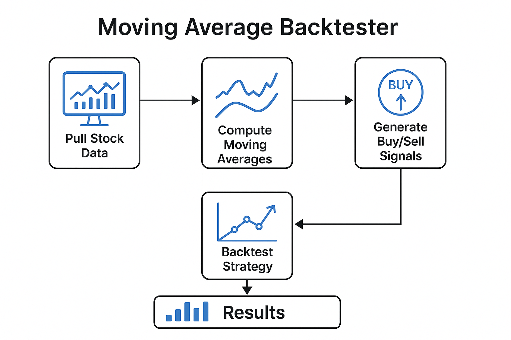
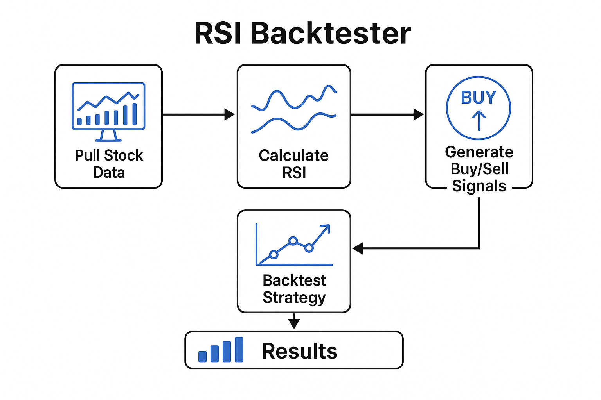
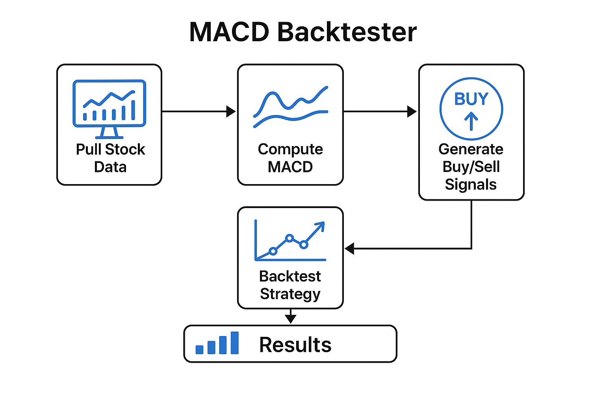

## BacktestX
    BacktestX is a modular Python backtesting framework that allows you to test different trading strategies on real historical stock data. Currently supports Moving Average Crossover, with more strategies (RSI, MACD) coming soon.

## Features
-   Pulls real stock data from yfinance API
-   Modular design:
    - Add your own strategies easily in `strategies/`.
    - Supports buy/sell signals and trade visualization.
    - Compares Strategy vs Buy & Hold performance.
-   Calculates key metrics:
    - CAGR
    - Sharpe Ratio
    - Max Drawdown
-   Saves performance charts in `assets/` folder.

## Tech
-   python 3
-   pandas
-   numpy
-   matplotlib
-   yfinance

## Run
    1. **Clone the repository**:
    ```bash
    git clone https://github.com/samkim701/moving-average-backtester.git
    cd moving-average-backtester
    2. pip install -r requirements.txt
    3. python backtester.py

## Sample Output

| Metric                  | Value     |
|-------------------------|----------:|
| **Total Strategy Return** | 84.52%   |
| **Total Buy & Hold Return** | 126.45%  |
| **CAGR**                  | 10.23%   |
| **Sharpe Ratio**          | 1.45     |
| **Sortino Ratio**         | 2.01     |
| **Max Drawdown**          | -15.87%  |



