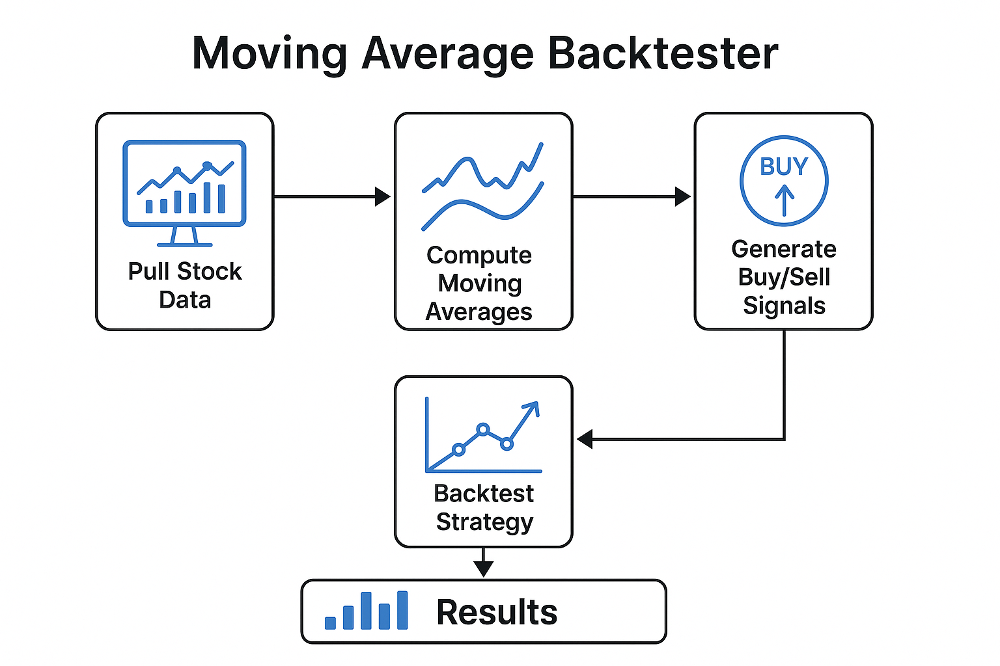

# moving_average_backtester
    Moving Average Backtester is a Python-based tool that analyzes and backtests a simple moving average crossover strategy on real historical stock data.

## Features
-   Pulls real stock data from yfinance API
-   It will compute 10-day and 50-day moving averages
-   Tells when to buy and sell (signals)
-   Shows if the backtest is effective (buy/hold vs backtest strategy)
-   Calculates performance matrics: CAGR, Max Drawdown, Sharp Ratio
-   Visualization

## Tech
-   python 3
-   pandas
-   numpy
-   matplotlib
-   yfinance

## Run
    1. **Clone the repository**:
    ```bash
    git clone https://github.com/samkim701/moving-average-backtester.git
    cd moving-average-backtester
    2. pip install -r requirements.txt
    3. python backtester.py


